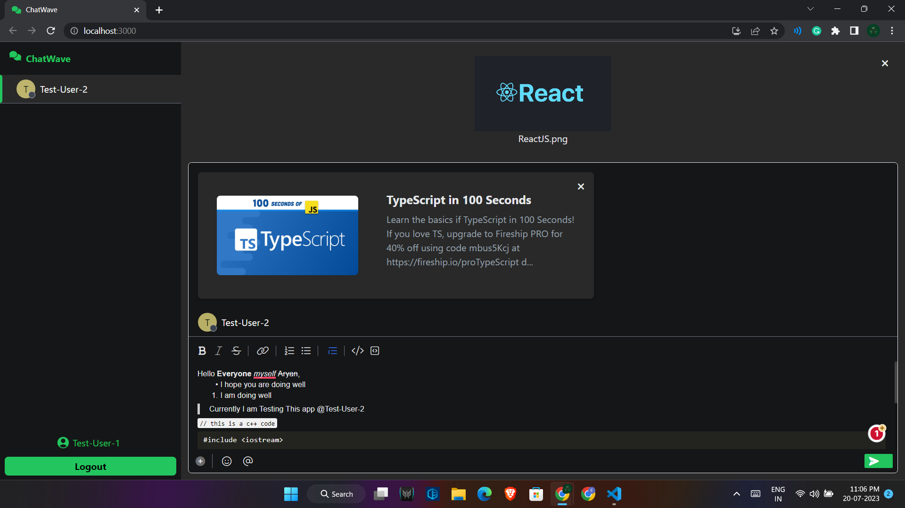

# Web App with React.js Frontend and TypeScript Backend

This repository contains a web application with a frontend built using React.js and a backend built using Node.js. Below are the instructions on how to install, deploy, run, and use the web app.

## Note

> * You may need to configure your own `.env` and `nodemon.json` files, although I have already provided sample configuration files named `.env.sample` and `nodemon.sample.json` inside client and server directories, respectively.
> * I recommend running the following command `npm run dev` in the server folder since it will directly take the environmental variables from the nodemon.json file. Otherwise, you will have to provide all the environmental variables in the command line itself.
> * You may also need to configure your own `MONGODB_URI` `inside nodemon.json`.
> * The preview of the web links is working, but you need to wait until it fetches the data from the server, which may take up to 4-5 minutes for the first request. After that, it will take less time.
> * You can find images related to this web application at the bottom of this file.

## Installation

1. Clone the repository to your local machine:

* git clone [https://github.com/your-username/Chat-Wave-MERN-Application.git](https://github.com/your-username/Chat-Wave-MERN-Application.git)
* `cd Chat-Wave-MERN-Application`

2. Install frontend dependencies:

* `cd client`
* `npm install`

3. Install backend dependencies:

* `cd server`
* `npm install`

## Deployment

### Frontend

To deploy the frontend, you have two options:

1. Development Build: Run the frontend in development mode with hot-reloading.

* `cd client`
* `npm start`

By default, the frontend will run on [http://localhost:3000](http://localhost:3000).

2. Production Build: Build the frontend for production.

* `cd client`
* `npm run build`

After running the production build, you will have a build directory containing the optimized files.

### Backend

To deploy the backend, you will need to compile the TypeScript code into JavaScript and then run the server.

1. Development Mode - Start the server:

* `cd server`
* `npm run dev`

2. Production Mode - Start the server:

* `cd server`
* `npm start`

By default, the backend will run on [http://localhost:8080](http://localhost:8080).

# Usage

With both the frontend and backend deployed, you can now access the web app through your browser.

1. Open your web browser and go to [http://localhost:3000](http://localhost:3000) (or the specified port if you modified it).

2. The web app will be loaded, and you can interact with its features.

# Folder Structure

Chat-Wave-MERN-Application/
├── client/
│   ├── public/
│   ├── src/
│   │   ├── components/
│   │   ├── context/
│   │   ├── hooks/
│   │   ├── App.tsx
│   │   └── index.tsx
│   ├── tsconfig.json
│   ├── tailwind.config.js
│   ├── package.json
│   └── ...
├── screenshots/
├── serer/
│   ├── dist/
│   │   ├── bin/
│   │   │   └── www.js
│   │   ├── config/
│   │   ├── controllers/
│   │   ├── middleware/
│   │   ├── models/
│   │   ├── routes/
│   │   ├── util/
│   │   └── app.js
│   ├── src/
│   │   ├── bin/
│   │   │   └── www.ts
│   │   ├── config/
│   │   ├── controllers/
│   │   ├── middleware/
│   │   ├── models/
│   │   ├── routes/
│   │   ├── util/
│   │   └── app.ts
│   ├── uploads/
│   ├── tsconfig.json
│   ├── package.json
│   └── ...
├── .gitignore
├── README.md
└── ...

# Sneak Peek

